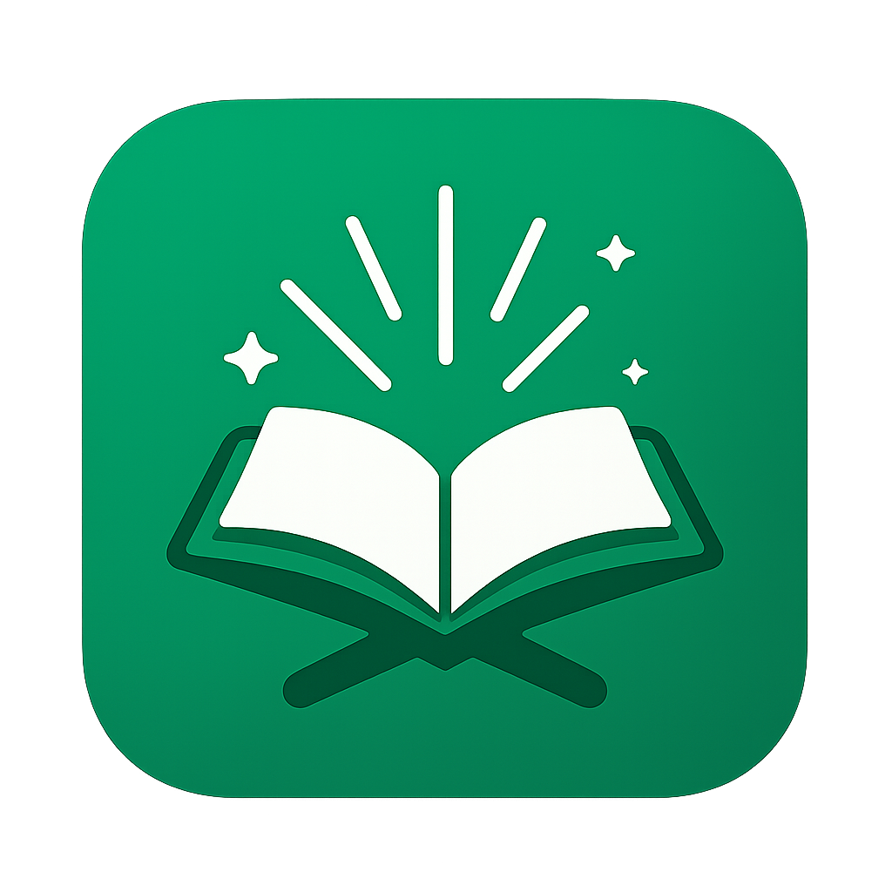

# 📖 القرآن الكريم - Quran Project



A modern web application for reading, memorizing, and reviewing the Holy Quran, built with Next.js and React.

## ✨ Features

- **🔍 Quran Browser**: Browse and read through all 114 surahs of the Quran
- **📱 PWA Support**: Install as a Progressive Web App on mobile and desktop devices
- **🎧 Audio Recitation**: Listen to high-quality recitation with verse repetition options
- **📚 Memorization System**: Structured lessons to help memorize the Quran with spaced repetition
- **🔖 Bookmarking**: Save your reading position and favorite verses
- **🌙 Dark Mode**: Support for light and dark themes
- **🇦🇷 Arabic Support**: Full support for Arabic text with proper typography
- **📊 Progress Tracking**: Track your memorization progress
- **🔄 Repeat Options**: Customizable verse repetition for effective memorization
- **📅 Ayah of the Day**: Daily Quranic verses with translations

## 🚀 Getting Started

### Prerequisites

- Node.js 18+ and npm/yarn

### Installation

1. Clone the repository

   ```bash
   git clone https://github.com/Abdelaziz79/quran-project.git
   cd quran-project
   ```

2. Install dependencies

   ```bash
   npm install
   # or
   yarn install
   ```

3. Run the development server

   ```bash
   npm run dev
   # or
   yarn dev
   ```

4. Open [http://localhost:3000](http://localhost:3000) in your browser

## 🧩 Project Structure

```
quran-project/
├── app/                  # Main app directory (Next.js App Router)
│   ├── _components/      # Shared UI components
│   │   ├── AudioPlayer.tsx        # Quran audio player
│   │   ├── SurahReader.tsx        # Surah reading component
│   │   ├── MemorizationLesson.tsx # Memorization lesson interface
│   │   └── ...
│   ├── _hooks/           # Custom React hooks
│   ├── _lib/             # Utility functions and helpers
│   ├── surah/            # Surah reading pages
│   ├── memorization/     # Memorization system pages
│   ├── bookmarks/        # Bookmark management pages
│   └── settings/         # User settings pages
├── components/           # UI component library
├── lib/                  # Core libraries and utilities
├── public/               # Static files and assets
└── ...
```

## 📱 Mobile Features

The app is designed to work well on mobile devices with:

- Responsive design for all screen sizes
- Touch-friendly controls
- PWA installation support
- Offline functionality

## 🌐 API Integration

This project uses the Quran API for fetching:

- Surah data and verses
- Audio recitations
- Translations

## 🎨 UI Components

The project uses a custom UI component system built on:

- TailwindCSS for styling
- Radix UI for accessible components
- Lucide React for icons

## 🔧 Configuration

You can customize various aspects of the app through the settings page, including:

- Audio reciter selection
- Display preferences
- Memorization settings
- Reading mode preferences

## 📦 Build and Deployment

To build the project for production:

```bash
npm run build
# or
yarn build
```

The build output will be in the `.next` directory.

## 📄 License

This project is licensed under the MIT License - see the LICENSE file for details.

## 🙏 Acknowledgements

- Quran API providers
- Open-source contributors
- All reciters whose audio recitations are used in the app

---

_This project aims to make the Quran more accessible for reading and memorization while providing modern web features._
